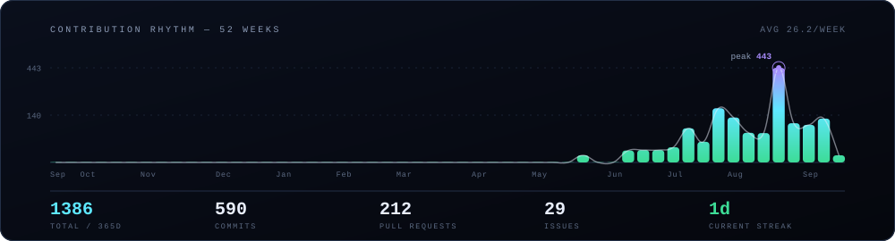

<div align="center">

<picture>
  <source media="(prefers-color-scheme: dark)" srcset="assets/hero-dark.svg" />
  <source media="(prefers-color-scheme: light)" srcset="assets/hero-light.svg" />
  
</picture>

</div>

I build software that removes friction — usually a browser tab that replaces a spreadsheet, a
manual process, or a "we've always done it by hand" workflow. Most of it lives in TypeScript and
Next.js, with Node and Python doing the work underneath.

Nothing on this page is a widget. No badge services, no vendor cards, no trackers: a small
dependency-free script reads the GitHub GraphQL API and draws every pixel you see here.

<!-- gen:snapshot -->
> **Live snapshot** · 1432 contributions in the last 365 days · 597 commits · 218 pull requests · 15 repositories touched in the last 90 days · current streak 4 days.
>
> Rendered 2026-09-23 16:53 UTC by [`tools/render`](tools/render) — every number and every pixel above comes from the GitHub GraphQL API, not from a third-party badge service.
<!-- /gen:snapshot -->

## Selected work

<!-- gen:work -->
**[rebar](https://github.com/Navesz/rebar)** — `JavaScript` · 2 ★ · updated today  
Repository checker and merge gate for projects written with AI agents. Audits any repository, scans versioned files for known prompt-injection signatures, and blocks the commit when a rule is ignored. Zero runtime dependencies.

**[OpenKartline](https://github.com/Navesz/openkartline)** — `TypeScript` · updated 5d ago  
Racing-line planner and lap-time estimator that runs in the browser. Draw or import a kart track, pick a class, and get a baseline line, braking points and an estimated lap time — a planning estimate, not a validated one.

**[OpenParts](https://github.com/Navesz/openparts)** — `Svelte` · updated 17d ago  
Local-first parts interchange lab. Cross-reference automotive part numbers entirely in the browser, with no backend to depend on.

**[Constellation](https://github.com/Navesz/constellation)** — `TypeScript` · updated 28d ago  
An observatory for public GitHub signals — profiles, achievements and activity, measured honestly instead of gamified.

**[Galegos](https://github.com/Navesz/Galegos)** — `TypeScript` · updated 28d ago  
Digital menu that hands the finished order off to WhatsApp. Built for a real kitchen, so it had to survive real customers.
<!-- /gen:work -->

## Rhythm

<div align="center">

<picture>
  <source media="(prefers-color-scheme: dark)" srcset="assets/pulse-dark.svg" />
  <source media="(prefers-color-scheme: light)" srcset="assets/pulse-light.svg" />
  
</picture>

</div>

Weekly totals instead of the usual 365-square grid. Consistency has a shape, and it is much
easier to read as a waveform than as a wall of tiny boxes.

## Stack

<div align="center">

<picture>
  <source media="(prefers-color-scheme: dark)" srcset="assets/spectrum-dark.svg" />
  <source media="(prefers-color-scheme: light)" srcset="assets/spectrum-light.svg" />
  
</picture>

</div>

Measured in bytes of code across public repositories — what I actually write, not a wall of logos
for things I once installed.

## Readable by machines, too

Profiles are increasingly consumed by software rather than people: agents summarising a candidate,
bots routing an issue, a model answering "who maintains this?". So this repository ships a
machine-readable layer alongside the human one.

- **[`llms.txt`](llms.txt)** — a plain-text brief following the [llms.txt](https://llmstxt.org)
  convention: who I am, what I build, what I am good at.
- **[`profile.json`](profile.json)** — the same information as structured data: stack shares,
  project summaries, live activity counters.

Both are regenerated on the same schedule as the images, so an agent reading them never gets a
stale answer.

<details>
<summary><b>How this profile renders itself</b></summary>

<br />

A scheduled GitHub Action runs [`tools/render`](tools/render) every six hours:

1. A single GraphQL query pulls public repositories, language byte counts and the contribution
   calendar.
2. Repositories are scored by recency, size and reach, then placed on a sunflower lattice. The
   constellation in the banner is the shape of my public work — it drifts as that work changes.
3. Three SVG panels are drawn from scratch in light and dark variants, with the CSS and SMIL
   animation baked directly into each file.
4. `llms.txt`, `profile.json` and the generated blocks in this README are rewritten.
5. A fingerprint of the underlying data decides whether any of that gets committed, so a quiet
   week costs zero commits instead of four a day of timestamp churn.

No runtime dependencies and no external image services. If GitHub is up, this page is accurate.

```bash
GITHUB_TOKEN=$(gh auth token) node tools/render/render.mjs
```

</details>

---

<div align="center">

<sub>Open to conversations about front-end architecture, developer tooling and open source.<br />
Best first contact: open an issue or a discussion on any repository above.</sub>

</div>
